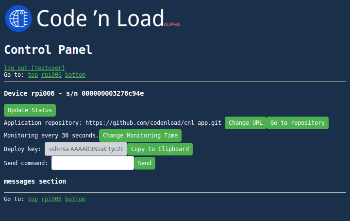

# **Code 'n Load** User Manual and Getting Started guide

In this document you'll learn how to set up your first device and how use the Control Panel.

## What you'll need

- [ ] A **Raspberry Pi** board connected to the Internet and accesible via SSH. See RPi's [official documentation](https://www.raspberrypi.org/documentation/setup/) and [SSH setup](https://www.raspberrypi.org/documentation/remote-access/ssh/) if you have doubts. *We tested other Linux SBC's but we recommend start with a Raspberry Pi*.
- [ ] A Code 'n Load account. If you don't have one, you can [request an invitation](https://www.codenload.com/#contact).
- [ ] Your PC/smartphone/tablet with Internet access and SSH client to connect to the device.

## Device setup

1. Access your RPi via SSH.
2. If it has the default hostname 'raspberrypi' you should change it alongside with the default user password. The hostname of your device will help you identify it later. Change the hostname (and the password for pi) using
```
sudo raspi-config
```
You may have to reboot the board after changing the hostname.
3. Install required packages.
```
sudo apt update
sudo apt install git netcat-openbsd libsystemd-dev autossh wiringpi
```
If you want to develop using Python, install these additional packages:
```
sudo apt install python-pip python-systemd python3-systemd python-sdnotify python3-sdnotify
sudo pip install wiringpi sdnotify
```
4. Clone CnL Daemon:
```
git clone https://github.com/codenload/cnld.git && cd cnld
```
5. Make and install (requires sudo privileges):
```
make
make install
```
We'll see the installation procedure on the next section.

## Installation procedure

The CnL daemon installation will setup some services in your device automatically but asking you a few things. Also, it will download a default application that you'll be able to change later. Finally it will register the device, associating it to your Code 'n Load account.
Here is a list of the services being installed:
- `cnld` the main Code 'n Load daemon. It will listen to commands sent from the Control Panel, controlling the user application and some parameters of the device.
- `cnl_ssh` the ssh daemon mantaining a ssh connection with the CnL server.
- `cnl_app` the daemon for the user application.

### Installation steps description

Each step is described and followed by a typical console output.

#### Step 1
The install procedure will start by building the `cnld` binary, checking the hostname and setting some environment variables located in `/etc/cnl.conf`. You can change their default values later if you want.

```
***********************************
*** Building server application ***
***********************************
make cnld
make[1]: Entering directory '/home/pi/cnld'
gcc  out/obj/cnld.o out/obj/command.o -Wl,--gc-sections -o out/cnld -lsystemd -lpthread -lm -lrt -lc
size out/cnld
   text	   data	    bss	    dec	    hex	filename
  13494	    600	     20	  14114	   3722	out/cnld
make[1]: Leaving directory '/home/pi/cnld'
*********************
*** Running setup ***
*********************
/home/pi/cnld/etc/setup.sh
****************************
*** Checking hostname... ***
****************************
*********************
*** Configuration ***
*********************
*** Backing-up /etc/cnl.conf to /etc/cnl.conf.old
*** Setting CNL_PATH=/home/pi/cnld
*** Setting CNL_APP_URL=https://github.com/codenload/cnl_app.git
*** Setting CNL_APP_PATH=/home/pi/cnl_app
*** Setting CNL_APP_MONITOR_TIME=30
```

#### Step 2
The installation script will generate pairs of ssh keys for the default user and the root user. These keys will allow SSH communication between the device and the CnL server. We recommend to leave the keys in their default paths. If you generated the keys previously, there is no need to generate them again, just answer 'no' if asked to overwrite the keys. **NOTE** that the root public key is only used to deploy your application from your repository, because the `cnld` daemon is a system service and executes `git` as the root user. It will not be used to login to your device as root. The 'PermitRootLogin' setting should be disabled by default in the SSH server configuration of the device (typically `/etc/ssh/sshd_config`).

```
********************************************************
*** Generate SSH keys. Please use default paths.     ***
*** If you want to keep the current key answer 'no'. ***
********************************************************
Generating public/private rsa key pair.
Enter file in which to save the key (/home/pi/.ssh/id_rsa):
Created directory '/home/pi/.ssh'.
Enter passphrase (empty for no passphrase):
Enter same passphrase again:
Your identification has been saved in /home/pi/.ssh/id_rsa.
Your public key has been saved in /home/pi/.ssh/id_rsa.pub.
[...]
Generating public/private rsa key pair.
Enter file in which to save the key (/root/.ssh/id_rsa):
Created directory '/root/.ssh'.
Enter passphrase (empty for no passphrase):
Enter same passphrase again:
Your identification has been saved in /root/.ssh/id_rsa.
Your public key has been saved in /root/.ssh/id_rsa.pub.
[...]
```
#### Step 3
The installation script will copy systemd service files for `cnld` and `cnl_app`, then it will clone, build and execute the default application. This default user application is located in https://github.com/codenload/cnl_app.git. It toggles the GPIO21 of the RPi every 200 milliseconds (aka blinky program). If you connect a LED to GPIO21 you should see it blinking after this step.

```
*************************************
*** Copying systemd unit files... ***
*************************************
****************************
*** Starting services... ***
****************************
Created symlink /etc/systemd/system/multi-user.target.wants/cnld.service → /etc/systemd/system/cnld.service.
Created symlink /etc/systemd/system/multi-user.target.wants/cnl_app.service → /etc/systemd/system/cnl_app.service.
********************************************************
*** Installing default application (blink GPIO21)... ***
********************************************************
GIT_SSH_COMMAND="ssh -o UserKnownHostsFile=/dev/null -o StrictHostKeyChecking=no" git clone https://github.com/codenload/cnl_app.git /home/pi/cnl_app 2>&1
Cloning into '/home/pi/cnl_app'...

command returned 0
make: Entering directory '/home/pi/cnl_app'
gcc -Wall -fdata-sections -ffunction-sections -std=gnu99 -c base/cnl_app_default.c -o out/obj/cnl_app_default.o -Iinc -Ibase -include wiringPi.h
gcc -Wall -fdata-sections -ffunction-sections -std=gnu99 -Iinc -Ibase -include wiringPi.h -c base/cnl_app_default.c -MM > out/obj/cnl_app_default.d
gcc -Wall -fdata-sections -ffunction-sections -std=gnu99 -c base/cnl_main.c -o out/obj/cnl_main.o -Iinc -Ibase -include wiringPi.h
gcc -Wall -fdata-sections -ffunction-sections -std=gnu99 -Iinc -Ibase -include wiringPi.h -c base/cnl_main.c -MM > out/obj/cnl_main.d
gcc -Wall -fdata-sections -ffunction-sections -std=gnu99 -c src/program.c -o out/obj/program.o -Iinc -Ibase -include wiringPi.h
gcc -Wall -fdata-sections -ffunction-sections -std=gnu99 -Iinc -Ibase -include wiringPi.h -c src/program.c -MM > out/obj/program.d
gcc  out/obj/cnl_app_default.o out/obj/cnl_main.o out/obj/program.o -Wl,--gc-sections -o out/cnl_app -lwiringPi -lsystemd -lpthread -lm -lrt -lc -lcrypt
size out/cnl_app
   text	   data	    bss	    dec	    hex	filename
   2164	    348	      4	   2516	    9d4	out/cnl_app
CNL_APP_PATH:/home/pi/cnl_app
sudo systemctl stop cnl_app.service
sudo cp out/cnl_app /usr/bin
sudo systemctl start cnl_app.service
make: Leaving directory '/home/pi/cnl_app'

OK(0)
*************
*** Done. ***
*************
```
#### Step 4
At this point the installation will ask you if you want to register the device. In order to control it from the Code 'n Load Control Panel, you should choose 'Yes'. If you choose 'No' you still will be able to control your device using CnL commands connecting to it directly via SSH, but it won't be accesible from the website.
```
*** Do you want to register this device?
1) Yes
2) No
#? 1
```

#### Step 5
Registration: In order to create a SSH tunnel from the CnL server to your device, the installation will try to figure out the device SSH listen port from the 'Port' setting in `/etc/ssh/sshd_config`. If it can't find it, please enter it mannualy when asked.

```
************************
*** Register device. ***
************************
*** Please enter this device SSH server port (22):
*** Setting CNL_SSH_LOCAL_PORT=22
```

#### Step 6
Enter your Code 'n Load username and password.

```
*** Please enter your Code 'n Load username: yourusername
*** Password:
```

#### Step 7
If everything goes well, the server will send its public key, local ssh tunnel port and other configuration parameters to the device. All these parameters are located in `/etc/cnl.conf`. Then the `cnl_ssh` service will be enabled and started.

```
*** Setting CNL_SSH_SERVER_URL=serverurl.example.com
*** Setting CNL_SSH_SERVER_PORT=123456
*** Setting CNL_SSH_USER=username
*** Adding key to /home/pi/.ssh/autorhized_keys
*** Setting CNL_SSH_REMOTE_PORT=123457
# add public key from server to known hosts
[...]
*************************************
*** Copying systemd unit files... ***
*************************************
****************************
*** Starting services... ***
****************************
Created symlink /etc/systemd/system/multi-user.target.wants/cnl_ssh.service → /etc/systemd/system/cnl_ssh.service.
*************
*** Done. ***
*************
```
#### Step 8
Now you can login to Control Panel! Go to https://www.codenload.com/cnl (using your PC or smartphone, of course...) and enter your username and password. Then you'll see your Control Panel as follows:

<div style="text-align:center"></div>

#### Sections:

- `log out [user]`: go back to the login page.
- `Go to`: quick shortcuts to top of page, each of your devices, and bottom of page.
- `Devices` section: A section for each one of your devices.
  - `Update status`: retrieve systemd status for `cnld` and user application.
  - `Application repository`: The URL of the repository where the user application is hosted. You can change it with the `Change URL` button and go to its page with the `Go to repository` button. If it's a private repository you should copy the deploy key of the device using the `Copy to Clipboard` button and pasting it on the repository deploy settings **before** changing the URL. Then you have to copy the SSH access URL, for example `git@github.com:codenload/cnl_app.git` and paste it in the `Change URL` dialog.
  - `Monitoring` time: You can change the time in seconds `cnld` connects to the application repository and check for new commits before updating the application. Use the `Change Monitoring Time` button to do this. If you set `0` seconds you will disable the monitor feature.
  - `Deploy key`: Used for access to private repositories using SSH.
  - `Send command`: You can send CnL commands directly to the device, for example `coretemp`, `blinkme`, `start`, `stop`, `journal app`, etc. Please see [`cnld` documentation](cnld.md) for details.
  - `messages section`: here you'll see the status and command responses.

### User Application Structure

The user application has a Makefile-based structure that you should mantain in your own application. The best thing to do is to fork one of the example repositories:
- https://github.com/codenload/cnl_app.git for Arduino-like C applications (main program in [src/program.c](https://github.com/codenload/cnl_app/blob/master/src/program.c)), and
- https://github.com/codenload/cnl_app_py.git for Python applications (main program in [src/program.py](https://github.com/codenload/cnl_app_py/blob/master/src/program.py)).
- See more examples in https://github.com/codenload.

And then update your device(s) with your repository URL or SSH access in the Control Panel. When you modify/commit/push your code, the device will automatically pull the changes, rebuild and restart the application.

Have fun, and happy coding! :wink:

*The Code 'n Load team - February 2018*
